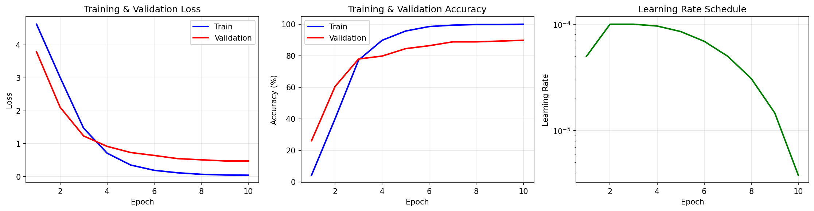
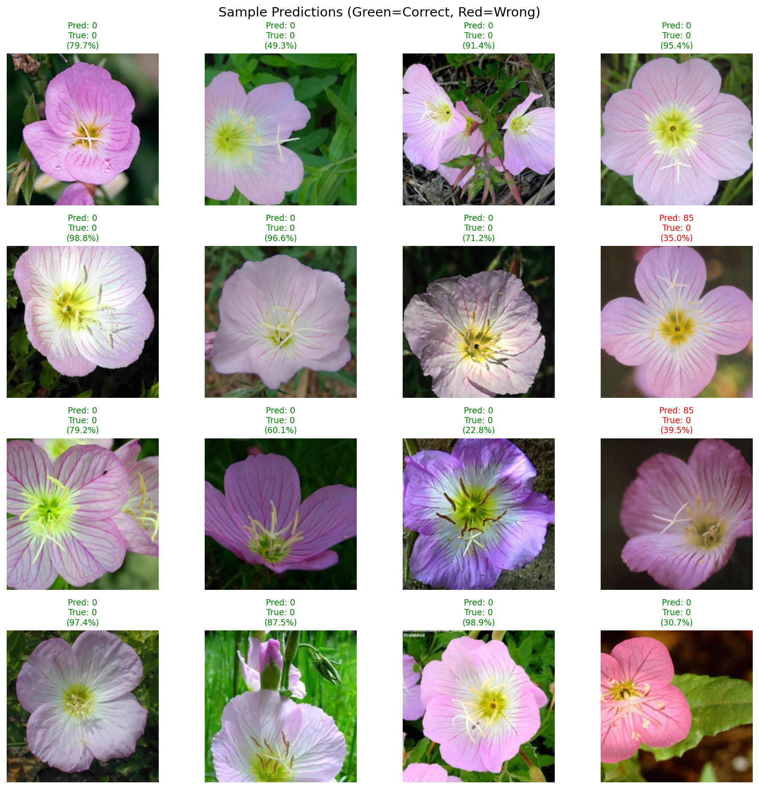
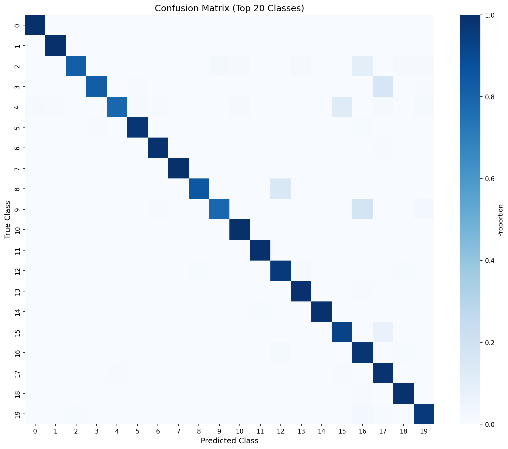

# Image Classifier with Transfer Learning

A flower image classifier using transfer learning with PyTorch. Fine-tunes pre-trained ResNet/EfficientNet models on the Flowers102 dataset.

## Overview

This project demonstrates:

- Transfer learning with pre-trained CNNs (ResNet18, ResNet50, EfficientNet-B0)
- Fine-tuning on a domain-specific dataset (102 flower categories)
- Complete training pipeline with data augmentation
- Model evaluation with multiple metrics

## Results

| Model           | Top-1 Acc | Top-5 Acc | F1-Score | Epochs |
| --------------- | --------- | --------- | -------- | ------ |
| ResNet18        | 86.34%    | 96.41%    | 86.49%   | 10     |
| ResNet50        | ~88%      | ~97%      | ~87%     | 15-20  |
| EfficientNet-B0 | ~87%      | ~97%      | ~86%     | 15-20  |

Tested on Apple Silicon (M-series) with MPS backend.

### Training Progress



### Sample Predictions



### Confusion Matrix



## Setup

```bash
# Create virtual environment
python -m venv venv
source venv/bin/activate  # Linux/Mac
# venv\Scripts\activate   # Windows

# Install dependencies
pip install -r requirements.txt
```

## Usage

```bash
# Train with default settings (ResNet50, 20 epochs)
python main.py

# Train with different model
python main.py --model resnet18 --epochs 15

# Evaluate existing checkpoint
python main.py --eval_only --checkpoint ./checkpoints/best_model.pth
```

## Arguments

| Argument          | Default  | Description                                              |
| ----------------- | -------- | -------------------------------------------------------- |
| --model           | resnet50 | Model architecture (resnet18, resnet50, efficientnet_b0) |
| --epochs          | 20       | Number of training epochs                                |
| --batch_size      | 32       | Batch size                                               |
| --lr              | 0.001    | Learning rate                                            |
| --patience        | 5        | Early stopping patience                                  |
| --freeze_backbone | False    | Freeze backbone weights                                  |

## Project Structure

```
image-classifier/
├── main.py              # Entry point
├── requirements.txt
├── src/
│   ├── dataset.py       # Data loading and augmentation
│   ├── model.py         # Model creation and transfer learning setup
│   ├── train.py         # Training loop
│   └── evaluate.py      # Evaluation metrics and plots
├── data/                # Downloaded automatically
├── checkpoints/         # Saved models
└── results/             # Plots and metrics
```

## Dataset

Flowers102 contains 8,189 images across 102 flower categories. The dataset is downloaded automatically on first run.

- Train: 1,020 images
- Validation: 1,020 images
- Test: 6,149 images

## Training Techniques

- Differential learning rate (lower LR for backbone, higher for classifier)
- Cosine annealing with warmup
- Data augmentation (random crop, flip, rotation, color jitter)
- Early stopping
- Gradient clipping

## Requirements

- Python 3.8+
- PyTorch 2.0+
- See requirements.txt for full list

## Author

Radu Popa
